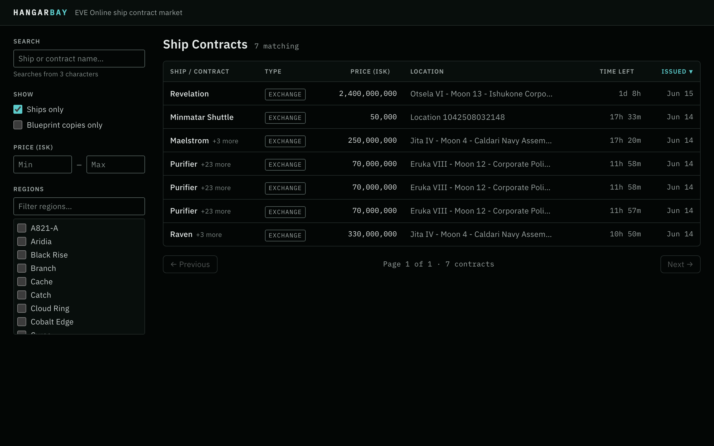

# Hangar Bay

An EVE Online in-game asset marketplace, focusing initially on ship sales.

This project was inspired by a discussion[1] about the capabilities of AI coding assistants to deliver comprehensive software projects. It serves as an ongoing experiment and example project for developing and refining sophisticated software design specifications tailored for AI-assisted development. I am using [Windsurf Editor](https://windsurf.com/editor) with its [Cascade](https://windsurf.com/cascade) AI coding assistant (primarily using the [Google Gemini Pro 2.5](https://deepmind.google/models/gemini/pro/) model) to develop this project.

I aim to demonstrate how detailed, AI-centric specifications can guide AI coding assistants to produce high-quality, secure, and maintainable software.

This project aims to shows how detailed, AI-focused specifications can steer coding assistants toward producing secure, maintainable software. I’m focused on baking non-functional requirements—security, accessibility, testability, observability, and internationalization (i18n)—into every step of AI-assisted development. Because these assistants tend to default to insecure patterns, I’ve created a [`security-spec.md`](/design/specifications/security-spec.md) that lays out project-specific design principles, a security checklist, and AI prompts for enforcing modern secure-coding practices across our tech stack.

[1]: "I can see where GPT could be useful for code snippets, but I can't imagine it's able to deliver any sort of comprehensive outcome. If I say, "write me an ecommerce site for selling ships in eve online" theres no way it's going to do that right? It's going to give me some template code about a shopping cart or something and thats it. Right?"
There's only one way to find out! 

## Screenshot (2026-07-12)

The React rebuild's contract list — ships-only default view against live ESI data.



## Project Documentation

For a comprehensive understanding of the Hangar Bay project, please refer to the following documents:

*   **[CONTRIBUTING.md](CONTRIBUTING.md):** Detailed guidelines for setting up your development environment, coding standards, version control workflows, testing procedures, dependency management, and specific instructions for AI assistants contributing to this project. **Start here if you plan to contribute or set up the project.**
*   **[`design-spec.md`](/design/specifications/design-spec.md):** The main design specification, providing a comprehensive overview of the project's architecture, features, technology stack, and design principles.
*   **[`design-log.md`](/design/meta/design-log.md):** A chronological record of major design decisions, architectural changes, and significant process updates made throughout the project.
*   The `design` directory contains further detailed specifications for various aspects of the application, including security, accessibility, testing, and individual features, all enhanced with AI-specific guidance.

## Core Technologies

*   **Backend:** Python with FastAPI
*   **Frontend:** React 19 (Vite, TypeScript, Tailwind CSS v4, TanStack Router/Query)
*   **Database:** PostgreSQL
*   **Caching:** Valkey
*   **Authentication:** EVE Online SSO (OAuth 2.0)

## Implementation Status

**Milestone 1 (frontend rebuild) — shipped.** The Angular frontend was removed and replaced with a React 19 single-page app (Vite, TypeScript strict, Tailwind CSS v4, TanStack Router/Query) in `app/frontend/web`, merged in PR #22. Live against the FastAPI backend:

*   **F001 (Public Contract Aggregation):** backend aggregation pipeline ingests public ship contracts from ESI into PostgreSQL.
*   **F002 (Ship Browsing & Advanced Search/Filtering):** contract list view with URL-driven filtering, sorting, and pagination.
*   **F003 (Detailed Ship/Contract View):** per-contract detail view.

**Milestone 2 (EVE SSO) — implemented.** F004 (User Authentication via EVE Online SSO) is implemented: header login/identity (login button, character name and portrait, logout), server-side sessions backed by Valkey, an encrypted token vault for EVE SSO access/refresh tokens, and CI coverage. The live-lane SSO login test (a real EVE SSO round trip) is deferred pending EVE credentials landing in the local `.env` plus a live end-to-end verification pass. The account features that depend on authentication (F005 Saved Searches, F006 Watchlists, F007 Alerts) remain deferred, gated on Milestone 3.

## Development Setup

This section guides you through setting up the Hangar Bay project for local development.

### Prerequisites

*   **Git:** For version control.
*   **Python:** Version 3.11 or newer for the backend.
*   **PDM (Python Dependency Manager):** For managing backend dependencies. Install it via `pipx install pdm` or `pip install --user pdm`. Refer to [PDM's official documentation](https://pdm-project.org/latest/getting-started/installation/) for more options.
*   **Node.js:** Version 20.19.0 or newer for the React frontend (includes npm).

### 1. Clone the Repository

```bash
git clone https://github.com/your-username/hangar-bay.git # Replace with your actual repo URL
cd hangar-bay
```

### 2. Backend Setup (Python/FastAPI with PDM)

1.  **Navigate to the backend directory:**
    ```bash
    cd app/backend
    ```

2.  **Install dependencies (including development tools like linters/formatters):
    ```bash
    pdm install -G dev
    ```
    This command reads the `pyproject.toml` and `pdm.lock` files, creates a virtual environment (in `.venv/` inside `app/backend/` if you've run `pdm config venv.in_project true`), and installs all necessary packages.

3.  **Activate the virtual environment (optional but recommended for IDEs):
    PDM automatically uses the project's virtual environment when you use `pdm run`. However, if your IDE or other tools need the environment to be explicitly activated, you can find the activation scripts within `app/backend/.venv/` (e.g., `app/backend/.venv/Scripts/activate` on Windows PowerShell/CMD, or `source app/backend/.venv/bin/activate` on Linux/macOS).

4.  **Running Linters and Formatters:**
    ```bash
    pdm run lint  # Runs Flake8
    pdm run format # Runs Black
    ```

5.  **Running the Development Server:**
    ```bash
    pdm run dev
    ```
    The FastAPI application should be available at `http://localhost:8000`.

### 3. Frontend Setup (React)

The React single-page app lives in `app/frontend/web` (Vite + React 19 + TypeScript + Tailwind CSS v4 + TanStack Router/Query).

1.  **Navigate to the frontend directory:**
    ```bash
    # From the project root
    cd app/frontend/web
    ```

2.  **Install dependencies:**
    ```bash
    npm install
    ```

3.  **Running the Development Server:**
    ```bash
    npm run dev
    ```
    The app is served at `https://localhost:5173` (Vite serves dev over HTTPS via `@vitejs/plugin-basic-ssl` so the origin matches the registered EVE SSO callback — accept the one-time self-signed-certificate warning), and proxies `/api/v1` requests to the backend on `http://localhost:8000` (the backend never sees TLS in dev).

4.  **Regenerating the API client types (after backend schema changes):**
    ```bash
    cd app/backend && pdm run export-openapi    # writes app/frontend/web/openapi.json
    cd app/frontend/web && npm run generate:api  # regenerates src/lib/api/schema.d.ts
    ```

---

To validate that detailed, AI-centric specifications can guide assistants to produce high-quality, secure, and maintainable software, we have to actually implement the plans. To that end, we are implementing an MVP of the Hangar Bay application, as outlined in the `plans/implementation/` directory.

The `plans/implementation/` directory contains implementation plans for the project, structured by phase and feature. Each plan is detailed in its own markdown file, providing a step-by-step guide to the development process.

*   **[`plans/implementation/00-mvp-implementation-plan-progress.md`](plans/implementation/00-mvp-implementation-plan-progress.md)** provides a progress log of the MVP implementation plan.
*   **[`plans/implementation/00-mvp-implementation-plan-overview.md`](plans/implementation/00-mvp-implementation-plan-overview.md)** provides a high-level overview of the MVP implementation plan.
*   **[`plans/implementation/phase-XX-phase-name/YY.Z-task-name.md`](plans/implementation/phase-XX-phase-name/YY.Z-task-name.md)** provides a detailed task file for a specific phase and task.

